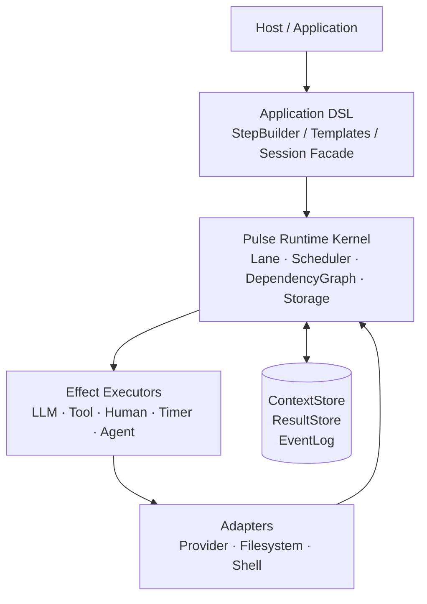
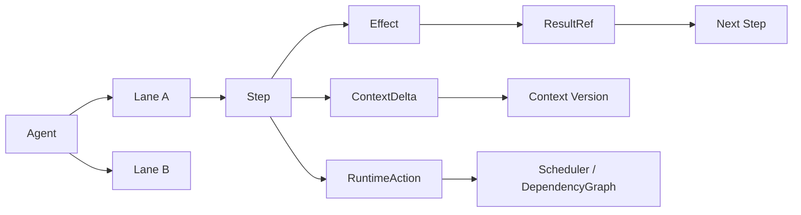
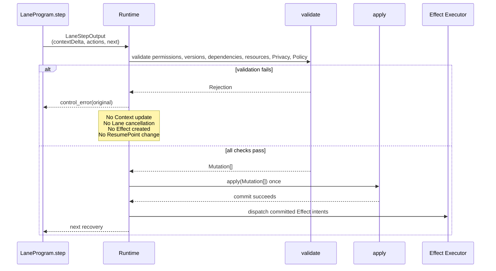
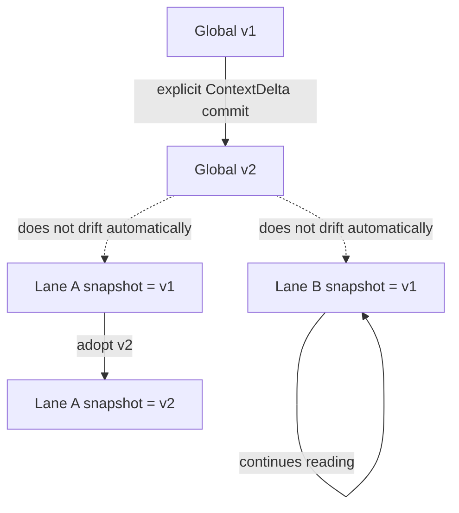

# Pulse Runtime

[简体中文](README.md)

Pulse is a recoverable runtime for multi-step Agent applications. It splits Agent execution into independent Lanes, each advanced by synchronous, pure-function Steps. Model calls, tool calls, human input, and child Agents are all Effects managed by the Runtime.

Pulse focuses on execution semantics: how state is committed, how concurrency is scheduled, how results are passed, whether cancellation and retries are safe, and whether context can be rebuilt after switching model Providers. Model Providers, tools, and host UIs are replaceable adapters.

The Scheduler uses deterministic Priority + Aging by default. For semantic attention allocation, an independent `SchedulerDecisionModel` can be injected through `schedulerDecision.model`. It only provides asynchronous ordering suggestions for eligible Ready Lanes. Suggestions pass through FactInbox, candidate epochs, reorder boundaries, and deterministic fairness safeguards; the model has no Runtime control authority.

> The repository currently implements the locally deliverable M0/M1/M1.5/M2 core described in the architecture document, including deterministic scheduling, DSL, Provider/Tool Host, File/SQLite persistence, checkpoints, Workers, and durable FactInbox deduplication. Real Providers, remote side effects, and production operations still require verification in their target environments.

## Why Pulse

Traditional Agent Loops often mix model calls, tool execution, context writes, parallel task startup, result waiting, and cancellation handling in one asynchronous function. This makes it difficult to preserve consistency across process restarts, network interruptions, model changes, and concurrent Lanes.

Pulse separates those concerns into explicit state transitions:

```text
Agent
  └── Lane
        └── synchronous Step
              ├── ContextDelta       cognitive state update
              ├── RuntimeAction[]    control intent
              └── EffectSubmission[] external execution intent
```

A Step does not perform I/O or mutate the Runtime directly. It only returns candidate output, which the Runtime validates and commits as a unit.

## Architecture overview



The Runtime kernel does not depend on a particular model vendor. A Provider Adapter only normalizes a vendor response into a shared `LLMResult`; it does not create RuntimeActions or execute tools directly.

## Core execution model

### Lane, Step, Action, and Effect



- **Agent** owns the goal, policy, Limits, and root Lane.
- **Lane** is a long-lived, recoverable execution line; there is no separate synchronous-Lane or asynchronous-Lane type.
- **Step** is a synchronous execution slice. It can only read fixed Runtime-injected input and return `LaneStepOutput`.
- **Action** represents control intent such as cancel, Fork, Wait, Adopt, complete, or fail.
- **Effect** represents work that must be completed by the Scheduler and an external executor.
- **ResultRef** points to an immutable result. Lanes consume results by reference instead of copying large outputs into context.

### Atomic Step Commit

A Step's cognitive update, control actions, and next execution position must commit together. External Effects are dispatched only after a successful commit.



`ContextDelta` carries cognitive state changes only; it cannot implicitly cancel a Lane or invoke a tool. If any validation fails, the whole `StepTransaction` is rejected.

## Context and snapshots

Pulse uses three Context layers: Global Context, Lane Context, and per-request LLM Context.



- Global Context is versioned.
- A Lane snapshot is pinned to a Global version.
- Publishing a new Global version does not silently change other Lanes.
- Only an explicit `adopt_context(v2 | 'latest')` switches the version used by subsequent Lane reads.
- When the current Lane commits a Global `ContextDelta`, `adoptCommittedContext` can switch to the new version in the same transaction.
- An LLM Request uses a fixed `LLMContextSpec`; later results cannot implicitly rewrite it while it is queued or being retried.

## LLM and ModelRouter

```mermaid
flowchart LR
    E[LLMEffect] --> P[fixed ContextSpec]
    P --> B[ContextBuilder]
    B --> F[capability / Privacy / window filtering]
    F --> M[ModelRouter]
    M --> A[Provider Adapter]
    A --> N[normalized LLMResult]
    N --> S[Schema validation]
    S --> RR[ResultRef]
    RR --> D[Action Decoder in next synchronous Step]
    D --> T[ToolEffect / Fork / ContextDelta]
```



The normalized result shape is:

```ts
interface LLMResult {
  text?: string
  toolCalls?: {
    id: string       // toolCallId generated by Pulse
    name: string
    arguments: JsonValue
  }[]
  structured?: JsonValue
  finishReason: 'stop' | 'tool_call' | 'length' | 'refusal' | 'error'
  refusal?: { reason?: string; message?: string }
  usage?: ModelUsage
}
```

Pulse maintains tool-call correlation itself:

```text
Pulse toolCallId
  ↓
ToolEffect
  ↓
ResultRef
  ↓
next model round or Lane Step
```

It does not depend on Provider Threads. The next round can use a different model, and requests can be rebuilt from Context and ResultStore data saved by Pulse.

## Key execution invariants

These rules are enforced by the kernel today:

- **Steps are synchronous pure functions.** Model calls, tools, child Agents, and human input are Effects. `step()` cannot `await` or read `Date.now()`.
- **A commit is all-or-nothing.** `contextDelta`, Actions, and `next` share one `validate → Mutation[] → apply` path. Any failure leaves Context, Effects, and ResumePoint unchanged.
- **Cancellation follows the ownership tree.** `cancel_lane` / `complete(children: 'cancel')` cover the target and all non-terminal descendants. A non-Owner can only `propose_cancel`. If the Owner's recovery slot is already occupied by wait / control_error, the proposal remains in `pendingControlProposals` and cannot replace the existing ResumeInput.
- **Unknown side effects are not treated as if they did not happen.** When a write Tool enters `reconcile_required`, a late completion settles the Outcome and clears quarantine without reviving the business Lane.
- **Persist before dispatch.** With File/SQLite backends attached, queued Effects wait for persistence to succeed. Invalid snapshots are not written; the Host sees `persistence.failed` / `effect.dispatch_blocked`.
- **Storage admission is incremental.** Previously written records are not rejected retroactively when limits are lowered. `__proto__`, `constructor`, and `prototype` cannot be Context paths.

## Privacy, cancellation, and retries

### Privacy Label

Privacy labels belong to data records, not temporary switches on an LLM request. M1 blocks cloud requests for request-level `local_only` data; M1.5 propagates record-level labels. The label order is:

```text
public < cloud_allowed < local_only
```

When data is derived, summarized, merged, or concatenated, the Runtime uses the strictest label among all sources and preserves `derivedFrom`. Requests containing `local_only` data cannot be sent to cloud models. Downgrades require an auditable human approval or a trusted redactor to create a new derived object.

### Unknown remote state

Execution state and business side-effect state are recorded separately:

```text
pure LLM: remote_unknown + sideEffectState=none
  → release local model slot
  → bounded retry or fallback according to duplicateExecutionPolicy

write Tool: remote_unknown + sideEffectState=unknown
  → reconcile_required / in_doubt
  → do not retry directly
```

### Cancellation and Quarantine

Cancellation is a structured state transition, not “send abort and call it done.” An Owner can prune the full subtree of its descendants; a non-Owner can only submit `propose_cancel`. Cancelling a queued Effect that has not acquired its lock must release the wait without granting the lock to a cancelled ghost request.

If an external system cannot confirm that work stopped, the Effect enters a QuarantineScope. The business Agent can return with `unresolvedEffectIds` instead of remaining suspended forever. A late `effect_completion` is handled as reconciliation and must not let a quarantine record diverge from Effect state, or snapshots could not be restored. Failure to create a Child Agent only fails the corresponding AgentEffect; it does not crash the parent Runtime tick.

## Progress monitoring

The Progress Watchdog compares stable cognitive and execution fingerprints instead of only counting Events:

```text
goalStateHash
contextVersion
actionSignature
resultSignature
resumeStep
localsHash
```

When Actions repeat, Context/Findings do not change, or the Goal makes no progress, the Runtime responds in stages: inject `control_error`, ask the Program to replan, then fail the Lane. Rejected StepTransactions do not enter the Watchdog window.

## DSL example

The following is a runnable application-layer DSL example. It compiles into pure-function Steps and serializable ResumePoints. The application still registers and configures Providers, ToolSets, and host credentials.

```ts
const program = defineLaneProgram({
  id: 'coding.main',
  version: '1',
  system: 'You are an experienced troubleshooting engineer. Act on evidence; do not speculate.',
  toolSet: 'coding.default',
  state: MainState,
}, (builder) => {
  builder.addStructuredLLMStep('plan', {
    task: 'plan',
    instruction: (view) => `Goal: ${view.goal}. Create a troubleshooting plan.`,
    schema: PlanSchema,
    onSuccess: (plan, ctx) => {
      ctx.mutateLane((draft) => { draft.plan = plan })
      return { step: 'dispatch' }
    },
  })

  builder.addParallelStep('dispatch', {
    lanes: {
      analyze: { goal: 'Analyze the root cause', program: analyzeProgramRef },
      tests: { goal: 'Prepare a reproduction test', program: testsProgramRef },
    },
    join: { condition: 'settled' },
    onJoin: (outcomes, ctx) => ({ step: 'verify' }),
  })
})
```

There are two ways for a host to run it:

```ts
const outcome = await runtime.run(agent.id)

const session = runtime.start(agent.id)
for await (const event of session.stream()) {
  // Observe events and mirrored fact events.
}
const finalOutcome = await session.outcome()
```

`runtime.run()` waits for the Agent to finish and returns an `Outcome`; `runtime.start()` is the interactive Session Facade provided by the DSL. Stream consumption does not block the Scheduler in the opposite direction. If a fact event is lost, resynchronize with `gap + snapshot()`.

## CLI

The Pulse CLI uses the current execution directory as its workspace and supports ongoing conversations like a local programming assistant.

### Install and start

Run this from the project root:

```bash
npx @hunterzhu/pulse-cli
```

On first launch, Pulse creates a user configuration automatically:

- macOS/Linux: `~/.pulse/config.json`
- Windows: `%USERPROFILE%\.pulse\config.json`

Pulse keeps user-level runtime files under one `.pulse` directory:

```text
~/.pulse/
├── config.json       # user configuration
├── data/             # sessions, run state, and recovery snapshots
├── logs/             # application logs
├── versions/pulse/   # standalone package and bundled server
└── bin/pulse         # macOS/Linux launcher; Windows uses bin/pulse.cmd
```

On Windows, `~` resolves to `%USERPROFILE%`. Set `PULSE_HOME` to move the whole directory; `PULSE_DATA_DIR` or `PULSE_LOG_DIR` can override data and log directories separately. The CLI `--data-dir` option has higher priority. Data from the old `~/.local/share/pulse` location is migrated to `~/.pulse/data` on first launch.

The config file stores Provider and runtime policy settings only. API Keys are read from environment variables and are not written to configuration or session data. Installing `@hunterzhu/pulse-cli` creates an example `.pulse/config.json` in the user's home directory (`%USERPROFILE%\.pulse` on Windows, `~/.pulse` on macOS/Linux); existing config is not overwritten. The initial active model is local `mock`, with example OpenAI and DeepSeek model mappings included.

### Common commands

```bash
# Run one task in the current project
npx @hunterzhu/pulse-cli run "Check this project's build issues"

# Enable read-only mode; prohibit file writes and Shell
npx @hunterzhu/pulse-cli --read-only

# Inspect local configuration, data directory, and tool status
npx @hunterzhu/pulse-cli doctor

# List saved conversations
npx @hunterzhu/pulse-cli sessions

# Enter the most recently saved conversation; recover unfinished work if present
npx @hunterzhu/pulse-cli --resume

# Continue an existing conversation
npx @hunterzhu/pulse-cli resume <conversation-id> "Continue the previous task"
```

Interactive startup does not create an empty conversation; it persists the conversation after the first ordinary message. Built-in commands include `/help`, `/status`, `/tools`, `/artifacts`, `/new`, `/resume`, `/cancel`, and `/exit`. `/resume` first recovers the latest unfinished run; otherwise it switches to the most recent conversation. You can enter additional information while a run is in progress. `/cancel` or Escape cancels the run and preserves the conversation. To create a config template first, run `npx @hunterzhu/pulse-cli setup`.

### Configure model Providers

Edit the user configuration. Providers and models are registered separately so model display names can avoid collisions between vendors:

The legacy single-`provider` configuration is no longer read. To create the new template for an existing config, run `npx @hunterzhu/pulse-cli setup --force`, then fill in the Providers, models, and environment variable names below.

```json
{
  "providers": {
    "openai": {
      "name": "OpenAI",
      "provider": "openai-compatible",
      "baseURL": "https://api.openai.com/v1",
      "apiKeyEnv": "OPENAI_API_KEY"
    },
    "deepseek": {
      "name": "DeepSeek",
      "provider": "deepseek",
      "baseURL": "https://api.deepseek.com",
      "apiKeyEnv": "DEEPSEEK_API_KEY"
    }
  },
  "models": {
    "gpt5.6-a": { "displayName": "gpt5.6-a", "provider": "openai", "modelCode": "gpt-5.6" },
    "gpt5.6-b": { "displayName": "gpt5.6-b", "provider": "deepseek", "modelCode": "deepseek-chat" }
  },
  "activeModel": "gpt5.6-a",
  "taskRouting": { "plan": ["gpt5.6-a", "gpt5.6-b"], "verify": ["gpt5.6-b", "gpt5.6-a"] },
  "approvalMode": "ask",
  "maxTurns": 32,
  "autoCompactPercent": 90,
  "allowNetwork": false
}
```

Then set the corresponding keys in the current Shell and start Pulse:

```bash
export OPENAI_API_KEY="your-api-key"
export DEEPSEEK_API_KEY="your-api-key"
npx @hunterzhu/pulse-cli
```

Approval modes are `ask` (confirm each time), `read-only` (prohibit writes and Shell), or `auto` (an independent model safety review checks an operation before execution). A ReAct run allows up to 32 turns by default; adjust it with `--max-turns 64` or config field `maxTurns`. Context is automatically compacted when estimated usage reaches `autoCompactPercent` (90 by default), and the session shows a notice. You can also run `/compact` at any time.

When an Agent needs input, it calls `ask.choice`, `ask.multi`, or `ask.input`. The CLI displays a single-choice, multi-choice, or text-input card; the answer returns to the same task run.

`taskRouting` defines ordered model candidates for planning, execution, merging, and verification. If one candidate fails, the next is tried. Unconfigured tasks keep using the current model. Tools and Skill extensions are loaded only from user-level configuration; a workspace `.pulse/config.json` cannot inject them into the process. You can explicitly enable PDF/XLSX reading, installed Skill instructions, or trusted MCP stdio services:

```json
{
  "capabilities": {
    "enabled": ["pdf", "spreadsheet", "skills", "browser"],
    "trustedSkillRoots": ["/absolute/path/to/.agents/skills"],
    "mcpServers": {
      "browser": { "command": "node", "args": ["/absolute/path/to/browser-mcp-server.js"] }
    }
  }
}
```

MCP configuration starts a local process, so only configure services you trust. Their tools are treated as external side effects and follow the active approval mode. Skills are automatically indexed by name from user-installed and explicitly trusted directories. Type `/` to search, use ↑/↓ to select and Tab to complete, then invoke with `/skill-name task`; only then is `SKILL.md` read into the current task context. The index stores names only, and the body is treated as untrusted reference instructions; code in it is not executed. Browser and Jarvis are currently capability catalog entries that require the user to install and configure their MCP services. Pulse does not pretend those connectors already exist.

A foreground Worker can process persistent scheduled tasks:

```bash
pulse schedule add --every 1h --name "Project check" "Check the project and report items that need attention"
pulse schedule list
pulse schedule pause <task-id>
pulse schedule resume <task-id>
pulse schedule remove <task-id>
pulse --read-only schedule daemon
```

Background tasks are stored in the Pulse data directory and support cross-process claim deduplication, failure records, and recovery after process exit. Workers require `read-only` or explicitly configured `auto` approval. For plans that write data, explicitly set `approvalMode: "auto"` in user config and keep model safety review enabled. `pulse schedule run-once` executes one currently due task.

In interactive mode, switch models with `/model gpt5.6-a`. You can also select a model at startup with `--model gpt5.6-a` or `PULSE_MODEL=gpt5.6-a`. See [`docs/cli-config.md`](./docs/cli-config.md) for the full configuration loading order and field reference.

## Repository documentation

- [Runtime architecture design](./pulse-runtime-architecture.md): state model, scheduling, Effects, Context, privacy, persistence boundaries, and acceptance contracts. See the examples above and `packages/runtime/src/dsl/` for DSL usage.
- [Agent task quality evaluations](./evals/README.md): fixed coding, research, and file-organization tasks with validation, isolated runs, mechanical artifact scoring, and reports. A dry run validates the evaluation set; it is not a real task-quality baseline.

## Local CI

After installing dependencies, run `pnpm ci:local` to perform the same checks, build, packaging, and install/uninstall verification as GitHub CI without publishing a release. Platform dependencies and verification scope are documented in [the release process](./docs/release.md#在本地运行-ci).

## Current verification boundaries

Use the actual output of `pnpm check` as the current workspace test result; its scope excludes `tests/live/**`. Tests include loopback Provider/Worker and SRT integration tests. `pnpm build`, evaluation-set validation, and independent CLI package extraction, execution, installation, and uninstall verification have also passed. A dry run only proves that the evaluation dataset is usable; it does not establish a real-model quality baseline.

Live Smoke tests with real Provider credentials, SRT device verification across Linux/Windows, side-effect reconciliation against real remote write systems, production multi-host Worker fault injection, cross-process Detached Agent scope migration, production privacy/permission audits, and external metrics and token-cost integration still require acceptance in a deployment environment. Browser and Jarvis are MCP integration points that require the user to install and explicitly configure services; this repository does not bundle or simulate those external services.
