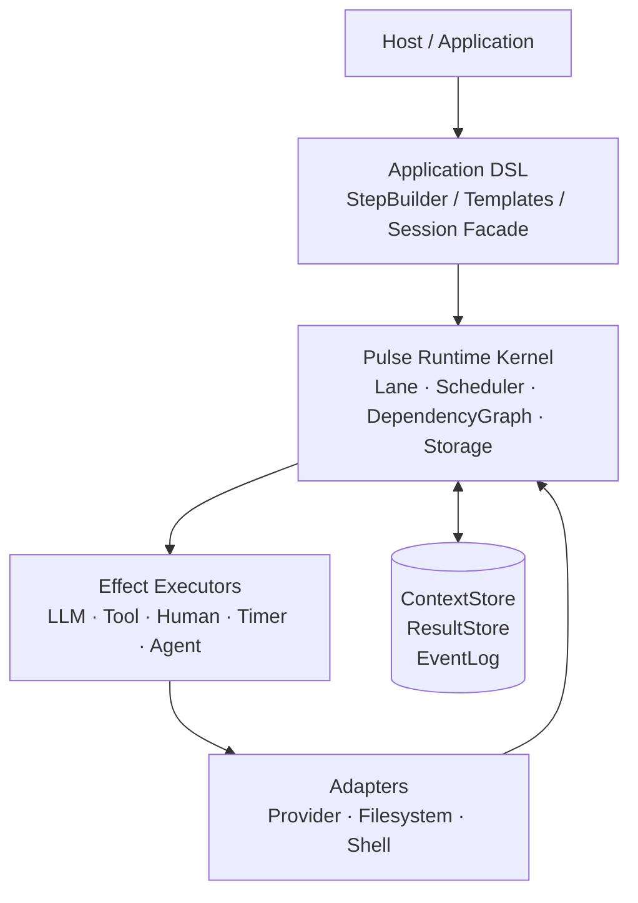
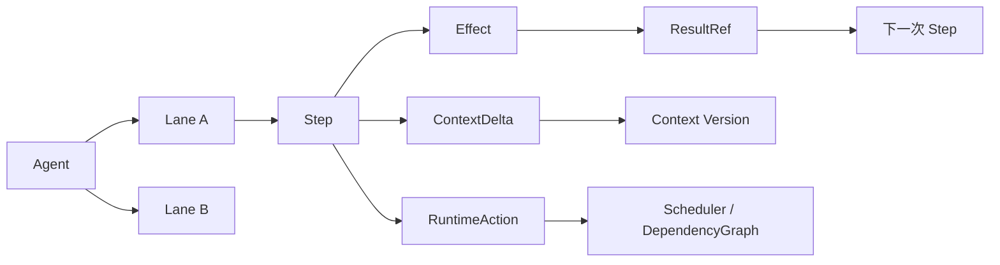
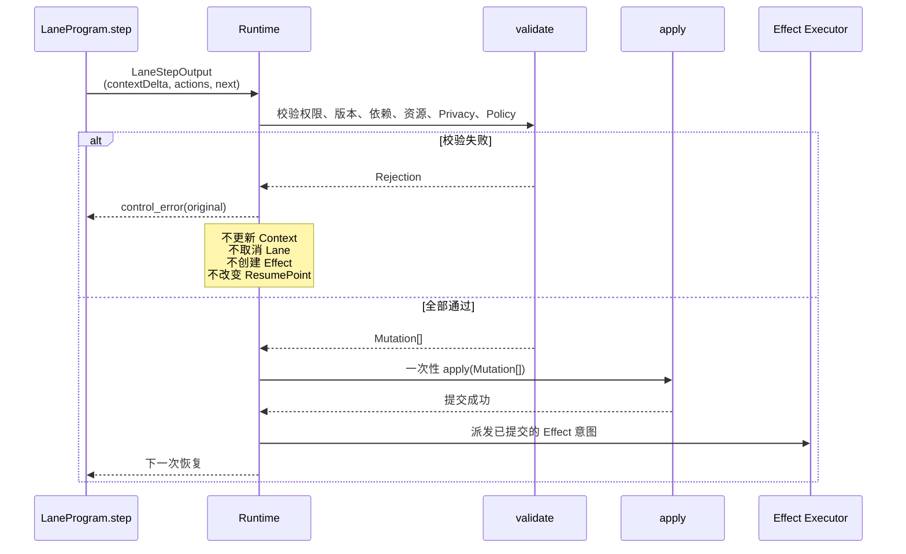
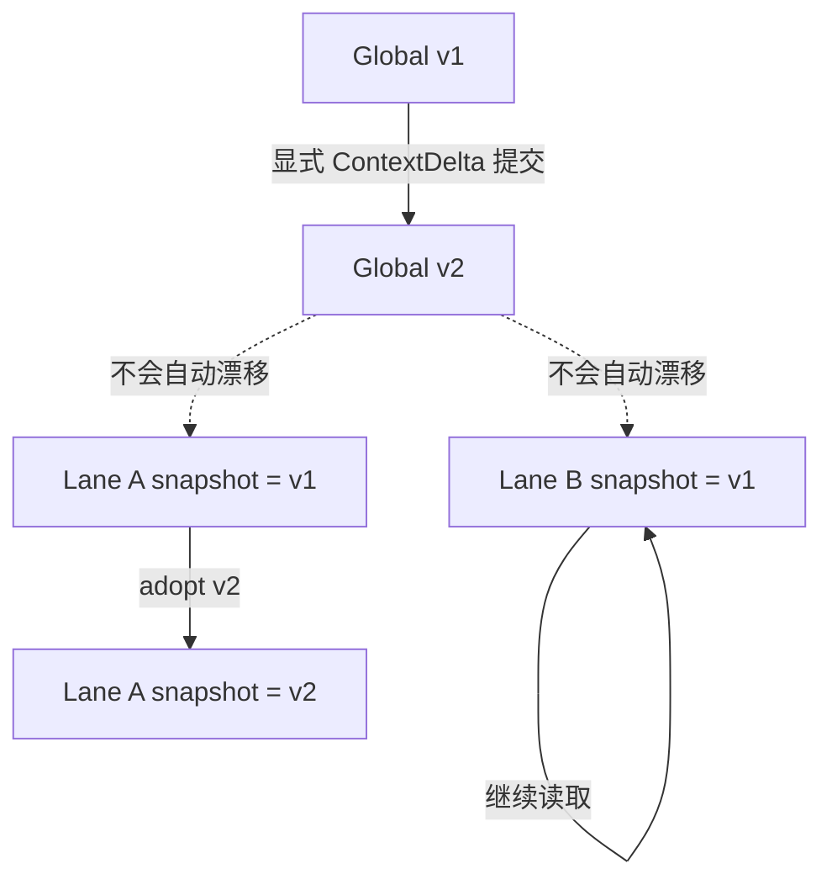
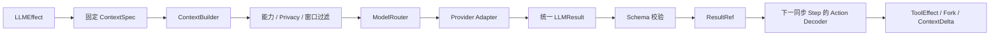

# Pulse Runtime

Pulse 是一个面向多步骤 Agent 应用的可恢复运行时。它把 Agent 的执行拆成多个独立的 Lane，每条 Lane 由同步、纯函数 Step 推进；模型调用、工具调用、人工输入和子 Agent 都作为受 Runtime 管理的 Effect 执行。

Pulse 关注的是执行语义：状态如何提交、并发如何调度、结果如何传递、取消和重试是否安全，以及模型换 Provider 后上下文是否仍然可重建。模型 Provider、工具和宿主 UI 都是可替换的适配层。

Scheduler 默认使用确定性的 Priority + Aging。需要语义化注意力分配时，可通过 `schedulerDecision.model` 注入独立的 `SchedulerDecisionModel`；它只对合法 Ready Lane 提供异步排序建议，所有建议都要经过 FactInbox、候选 epoch、重排边界和确定性公平保底校验，不具备 Runtime 控制权。

> 当前仓库已实现架构文档中可在本地落地的 M0/M1/M1.5/M2 主链，包括确定性调度、DSL、Provider/Tool Host、File/SQLite 持久化、checkpoint、Worker 和 FactInbox durable dedupe。真实 Provider、远程副作用和生产运维仍需独立环境验收。

## 为什么需要 Pulse

传统 Agent Loop 往往把这些事情混在一个异步函数里：调用模型、执行工具、写上下文、启动并行任务、等待结果和处理取消。这样很难保证进程重启、网络断开、模型切换或多个 Lane 并发时仍然保持一致。

Pulse 将它们拆成明确的状态转换：

```text
Agent
  └── Lane
        └── synchronous Step
              ├── ContextDelta       认知状态更新
              ├── RuntimeAction[]    控制意图
              └── EffectSubmission[] 外部执行意图
```

Step 不直接执行 I/O，也不直接修改 Runtime。它只返回候选输出，Runtime 统一校验并提交。

## 总体架构



运行时内核不依赖某个模型供应商。Provider Adapter 只负责把供应商响应归一化成统一的 `LLMResult`；它不会生成 RuntimeAction，也不会直接执行工具。

## 核心执行模型

### Lane、Step、Action 和 Effect



- **Agent** 拥有目标、策略、Limits 和根 Lane。
- **Lane** 是长期存在的可恢复执行线，不区分同步 Lane 和异步 Lane。
- **Step** 是同步执行切片，只能读取 Runtime 注入的固定输入并返回 `LaneStepOutput`。
- **Action** 表示取消、Fork、Wait、Adopt、完成或失败等控制意图。
- **Effect** 表示需要调度器和外部执行器完成的工作。
- **ResultRef** 指向不可变结果；Lane 通过引用消费结果，而不是把大输出复制进上下文。

### 原子 Step Commit

一次 Step 的认知更新、控制动作和下一执行位置必须一起提交。外部 Effect 只有在提交成功后才会派发。



`ContextDelta` 只携带认知状态变化，不能隐含 `cancel_lane` 或工具调用。任意一项校验失败，整个 `StepTransaction` 都不提交。

## Context 与 Snapshot

Pulse 使用三层 Context：Global Context、Lane Context 和单次 LLM Request Context。



- Global Context 按版本保存。
- Lane 的 Snapshot 固定在某个 Global 版本。
- Global 发布新版本不会偷偷改变其他 Lane。
- 只有显式 `adopt_context(v2 | 'latest')` 才会切换 Lane 的后续读取版本。
- 当前 Lane 自己提交 Global `ContextDelta` 时，可以使用 `adoptCommittedContext` 在同一事务内切换到新版本。
- LLM Request 使用固定的 `LLMContextSpec`，排队或重试期间不会被后来结果隐式改写。

## LLM 与 ModelRouter



统一结果形状为：

```ts
interface LLMResult {
  text?: string
  toolCalls?: {
    id: string       // Pulse 生成的 toolCallId
    name: string
    arguments: JsonValue
  }[]
  structured?: JsonValue
  finishReason: 'stop' | 'tool_call' | 'length' | 'refusal' | 'error'
  refusal?: { reason?: string; message?: string }
  usage?: ModelUsage
}
```

工具调用的关联由 Pulse 自己维护：

```text
Pulse toolCallId
  ↓
ToolEffect
  ↓
ResultRef
  ↓
下一轮模型或 Lane Step
```

它不依赖 Provider Thread，因此可以在下一轮切换模型，也可以从 Pulse 自己保存的 Context 和 ResultStore 重建请求。

## 关键执行不变量

下列规则已经写进内核，而不是“以后再说”：

- **Step 是同步纯函数。** 模型、工具、子 Agent、人工输入都是 Effect；`step()` 不能 `await`，也不能读 `Date.now()`。
- **一次提交要么全部生效。** `contextDelta`、Action 和 `next` 走同一条 `validate → Mutation[] → apply`；任意一项失败都不改 Context、不创建 Effect、不移动 ResumePoint。
- **取消沿所有权树走。** `cancel_lane` / `complete(children: 'cancel')` 覆盖目标及其全部非终态子孙。非 Owner 只能 `propose_cancel`；若 Owner 的恢复槽已被 wait / control_error 占用，提案停在 `pendingControlProposals`，不能覆盖已有 ResumeInput。
- **副作用未知不能假装没发生。** 写入型 Tool 进入 `reconcile_required` 后，迟到的完成会结算 Outcome 并清 quarantine，业务 Lane 不因此复活。
- **先落盘再派发。** 挂接 File/SQLite 后端时，queued Effect 必须等 persist 成功；校验失败的快照不会写入，Host 会看到 `persistence.failed` / `effect.dispatch_blocked`。
- **存储准入是增量的。** 已写入的记录不因事后下调限额被重新拒绝；`__proto__` / `constructor` / `prototype` 不能作为 Context 路径。

## 隐私、取消与重试

### Privacy Label

隐私标签属于数据记录，而不是某次 LLM 请求的临时开关。M1 先执行请求级 `local_only` 云端阻断，M1.5 完成记录级标签传播。记录级标签为：

```text
public < cloud_allowed < local_only
```

派生、摘要、合并或拼接结果时，Runtime 取所有来源中最严格的标签，并保留 `derivedFrom`。包含 `local_only` 数据的请求不能发送到云端模型；降级只能通过可审计的人为批准或可信脱敏器产生新的派生对象。

### 远端未知状态

执行状态和业务副作用状态分开记录：

```text
纯 LLM：remote_unknown + sideEffectState=none
  → 可释放本地模型槽
  → 按 duplicateExecutionPolicy 有界重试或 fallback

写入型 Tool：remote_unknown + sideEffectState=unknown
  → reconcile_required / in_doubt
  → 不直接重复执行
```

### 取消与 Quarantine

取消是结构化状态转换，不是“发个 abort 就算结束”。Owner 可以剪枝自有后代整棵子树；非 Owner 只能提交 `propose_cancel`。排队中尚未拿到锁的 Effect 取消时必须释放等待，不能把锁授给已取消的幽灵请求。

如果外部系统无法确认停止，Effect 进入 QuarantineScope，业务 Agent 可以带着 `unresolvedEffectIds` 返回，而不会被永久挂起。迟到的 `effect_completion` 按对账处理，不能让 quarantine 条目与 Effect 状态分叉，否则快照无法 restore。创建 Child Agent 失败只失败对应 AgentEffect，不会把父 Runtime tick 一起打崩。

## 进展监测

Progress Watchdog 不只统计 Event 数量，而是比较稳定的认知和执行指纹：

```text
goalStateHash
contextVersion
actionSignature
resultSignature
resumeStep
localsHash
```

重复 Action、Context/Finding 没有变化、Goal 没有推进时，Runtime 分级处理：注入 `control_error`、要求 Program replan、最后失败 Lane。被拒绝的 StepTransaction 不进入 Watchdog 窗口。

## DSL 示例

下面是应用层 DSL 的可运行用法。它编译成纯函数 Step 和可序列化 ResumePoint；Provider、ToolSet 和宿主凭证仍由应用侧注册与配置。

```ts
const program = defineLaneProgram({
  id: 'coding.main',
  version: '1',
  system: '你是资深排障工程师。按证据行动，不臆测。',
  toolSet: 'coding.default',
  state: MainState,
}, (builder) => {
  builder.addStructuredLLMStep('plan', {
    task: 'plan',
    instruction: (view) => `目标：${view.goal}。制定排查计划。`,
    schema: PlanSchema,
    onSuccess: (plan, ctx) => {
      ctx.mutateLane((draft) => { draft.plan = plan })
      return { step: 'dispatch' }
    },
  })

  builder.addParallelStep('dispatch', {
    lanes: {
      analyze: { goal: '分析根因', program: analyzeProgramRef },
      tests: { goal: '准备复现测试', program: testsProgramRef },
    },
    join: { condition: 'settled' },
    onJoin: (outcomes, ctx) => ({ step: 'verify' }),
  })
})
```

宿主有两种运行方式：

```ts
const outcome = await runtime.run(agent.id)

const session = runtime.start(agent.id)
for await (const event of session.stream()) {
  // 观测事件和事实事件镜像
}
const finalOutcome = await session.outcome()
```

`runtime.run()` 等待 Agent 收尾并返回 `Outcome`；`runtime.start()` 是 DSL 提供的交互式 Session Facade。流消费不会反向阻塞 Scheduler，事实事件丢失时通过 `gap + snapshot()` 重同步。

## CLI 使用

Pulse CLI 会把当前执行目录作为工作目录，启动后可以像本地编程助手一样持续对话。

### 安装与启动

在项目根目录直接运行：

```bash
npx @hunterzhu/pulse-cli
```

首次启动会自动创建用户配置文件，不需要手动建立目录：

- macOS/Linux：`~/.pulse/config.json`
- Windows：`%USERPROFILE%\.pulse\config.json`

Pulse 的用户级运行目录统一放在同一个 `.pulse` 目录下：

```text
~/.pulse/
├── config.json       # 用户配置
├── data/             # 会话、运行状态和恢复快照
├── logs/             # 应用日志
├── versions/pulse/   # 独立安装包及内置 server
└── bin/pulse         # macOS/Linux 启动器；Windows 使用 bin/pulse.cmd
```

Windows 会把 `~` 解析为 `%USERPROFILE%`。可以用 `PULSE_HOME` 移动整个目录，用 `PULSE_DATA_DIR` 或 `PULSE_LOG_DIR` 单独覆盖数据和日志目录；命令行的 `--data-dir` 优先级更高。旧版本使用的 `~/.local/share/pulse` 会在首次启动时自动迁移到 `~/.pulse/data`。

配置文件只保存 Provider 和运行策略，API Key 通过环境变量读取，不会写入配置或会话数据。安装 `@hunterzhu/pulse-cli` 时会在用户主目录自动创建 `.pulse/config.json` 示例配置（Windows 使用 `%USERPROFILE%\.pulse`，macOS/Linux 使用 `~/.pulse`），已有配置不会被覆盖。初始激活模型是本地 `mock`，也附有 OpenAI 和 DeepSeek 的模型映射示例。

### 常用命令

```bash
# 对当前项目执行一次任务
npx @hunterzhu/pulse-cli run "检查这个项目的构建问题"

# 指定只读模式，禁止写文件和执行 Shell
npx @hunterzhu/pulse-cli --read-only

# 查看本地配置、数据目录和工具状态
npx @hunterzhu/pulse-cli doctor

# 查看已保存的会话
npx @hunterzhu/pulse-cli sessions

# 直接进入最近一次保存的会话；如果有未完成运行则自动恢复
npx @hunterzhu/pulse-cli --resume

# 继续一个已有会话
npx @hunterzhu/pulse-cli resume <conversation-id> "继续处理上次的问题"
```

交互模式启动时不会创建空会话，发送第一条普通消息后才会持久化会话。内置 `/help`、`/status`、`/tools`、`/artifacts`、`/new`、`/resume`、`/cancel` 和 `/exit`；`/resume` 会优先恢复最近一个未完成运行，否则切换到最近一次会话。运行中仍可直接输入补充信息；`/cancel` 或按 Escape 会取消当前运行并保留会话。需要先生成配置模板时，可以运行 `npx @hunterzhu/pulse-cli setup`。

### 配置模型 Provider

编辑用户配置文件。供应商和模型分开注册，模型显示名可以避免不同供应商的同名模型冲突：

旧版单 `provider` 配置不再读取。已有配置可以先运行 `npx @hunterzhu/pulse-cli setup --force` 生成新模板，再填入下面的供应商、模型和环境变量名。

```json
{
  "providers": {
    "openai": {
      "name": "OpenAI",
      "provider": "openai-compatible",
      "baseURL": "https://api.openai.com/v1",
      "apiKeyEnv": "OPENAI_API_KEY"
    },
    "deepseek": {
      "name": "DeepSeek",
      "provider": "deepseek",
      "baseURL": "https://api.deepseek.com",
      "apiKeyEnv": "DEEPSEEK_API_KEY"
    }
  },
  "models": {
    "gpt5.6-a": { "displayName": "gpt5.6-a", "provider": "openai", "modelCode": "gpt-5.6" },
    "gpt5.6-b": { "displayName": "gpt5.6-b", "provider": "deepseek", "modelCode": "deepseek-chat" }
  },
  "activeModel": "gpt5.6-a",
  "taskRouting": { "plan": ["gpt5.6-a", "gpt5.6-b"], "verify": ["gpt5.6-b", "gpt5.6-a"] },
  "approvalMode": "ask",
  "maxTurns": 32,
  "autoCompactPercent": 90,
  "allowNetwork": false
}
```

然后在当前 Shell 中设置对应密钥并运行：

```bash
export OPENAI_API_KEY="your-api-key"
export DEEPSEEK_API_KEY="your-api-key"
npx @hunterzhu/pulse-cli
```

审批模式可以设置为 `ask`（每次由你确认）、`read-only`（禁止写入和 Shell）或 `auto`（由独立的模型安全审查先替你判断，再执行通过的操作）。一次 ReAct 运行默认最多 32 轮，可用 `--max-turns 64` 或配置文件中的 `maxTurns` 调整。上下文默认在估算用量达到 `autoCompactPercent`（默认 90）时自动压缩，会话里会留下提示；也可以随时用 `/compact` 手动压缩。

Agent 需要询问你时，会调用 `ask.choice`、`ask.multi` 或 `ask.input`。CLI 会显示对应的单选、多选或文本输入卡片，回答会回到同一轮任务中。

`taskRouting` 为规划、执行、合并和验收分别配置有序模型候选；某个候选调用失败时会尝试下一项，未配置的任务沿用当前模型。工具和技能扩展只从用户级配置读取，不接受工作区 `.pulse/config.json` 注入进程。可以显式启用 PDF/XLSX 读取、已安装 Skill 指令或受信任的 MCP stdio 服务：

```json
{
  "capabilities": {
    "enabled": ["pdf", "spreadsheet", "skills", "browser"],
    "skills": ["review"],
    "mcpServers": {
      "browser": { "command": "node", "args": ["/absolute/path/to/browser-mcp-server.js"] }
    }
  }
}
```

MCP 配置会启动本机进程，必须只填写自己信任的服务；服务工具按外部副作用处理并遵守当前审批模式。Skill 只读取用户级安装目录或显式信任的绝对目录中的 `SKILL.md`，内容作为不可信参考指令，不执行其中代码。浏览器与 Jarvis 目前是可接入的能力目录项，需要用户安装并配置对应 MCP 服务；Pulse 不会假装这些连接器已经存在。

持久化定时任务可由一个前台 Worker 处理：

```bash
pulse schedule add --every 1h --name "项目巡检" "检查项目状态并报告需要处理的问题"
pulse schedule list
pulse schedule pause <task-id>
pulse schedule resume <task-id>
pulse schedule remove <task-id>
pulse --read-only schedule daemon
```

后台任务存储在 Pulse 数据目录下，支持跨进程 claim 防重、失败记录和进程退出恢复。Worker 要求 `read-only` 或显式 `auto` 审批；需要写入的计划应在用户配置中明确设置 `approvalMode: "auto"`，并保持模型安全审查开启。`pulse schedule run-once` 可执行当前已到期的一轮任务。

交互模式中可以用 `/model gpt5.6-a` 切换模型；启动时也可以用 `--model gpt5.6-a` 或 `PULSE_MODEL=gpt5.6-a` 选择模型。完整配置加载顺序和字段说明见 [`docs/cli-config.md`](./docs/cli-config.md)。

## 仓库文档

- [Runtime 架构设计](./pulse-runtime-architecture.md)：状态模型、调度、Effect、Context、隐私、持久化边界和验收契约。DSL 用法见上文示例与 `packages/runtime/src/dsl/`。
- [Agent 任务质量评测](./evals/README.md)：固定的代码、研究和文件整理任务集，支持验证、隔离运行、机械产物评分与报告。dry run 只验证评测集，不构成真实任务质量基线。

## 本地 CI

安装依赖后运行 `pnpm ci:local`，即可在本机执行与 GitHub CI 相同的检查、构建、打包和安装/卸载验证，不会发布版本。平台依赖和验证范围见 [发布流程](./docs/release.md#在本地运行-ci)。

## 当前验证边界

当前工作区的测试结果以 `pnpm check` 的实际输出为准，不再固定具体数量（其范围不含 `tests/live/**`）；测试包含 loopback Provider/Worker 与 SRT 集成测试；`pnpm build`、评测集验证和独立 CLI 包的解压、运行、安装、卸载验证也已通过。dry run 只证明评测数据集可用，不代表真实模型质量基线。

真实 Provider 凭证下的 Live Smoke、跨 Linux/Windows 的 SRT 实机验证、真实远程写系统的副作用对账、生产级多主机 Worker 故障注入、跨进程 Detached Agent scope 迁移、生产级隐私/权限审计，以及外部指标和 Token 成本接入仍需部署环境单独验收。Browser 与 Jarvis 是 MCP 能力接入点，需用户安装并显式配置服务；本仓库没有内置或模拟这些外部服务。
