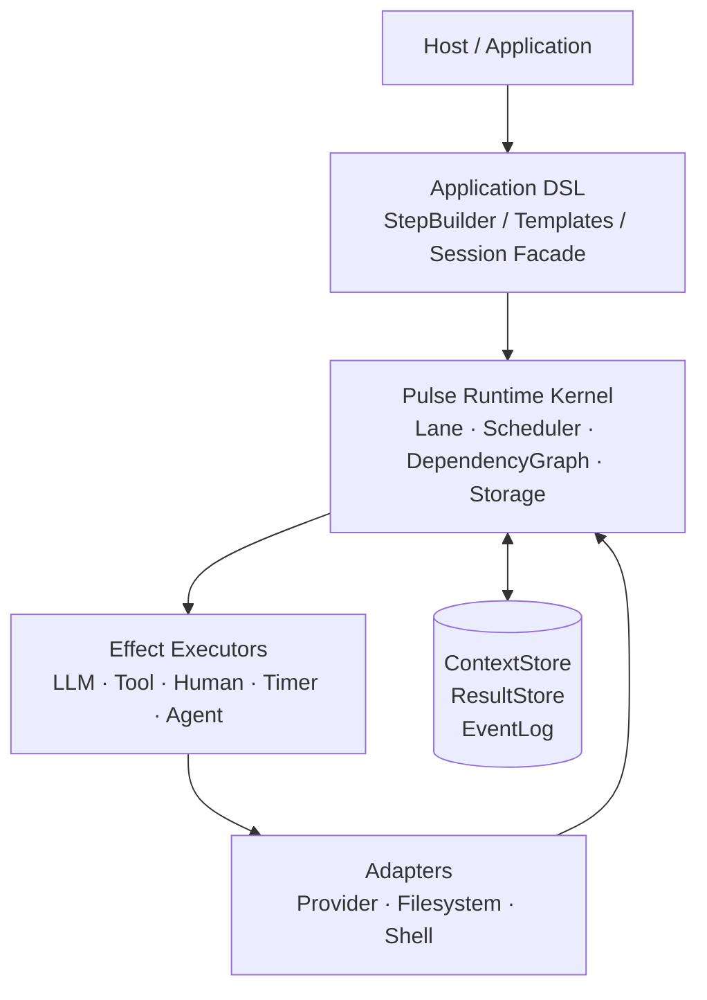
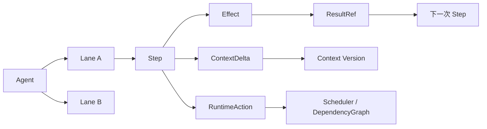
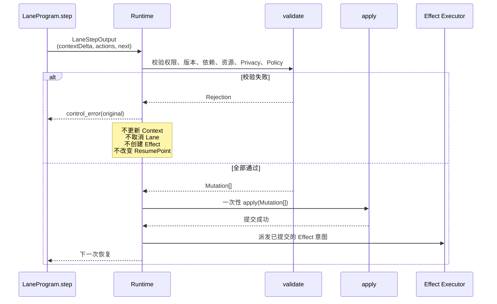
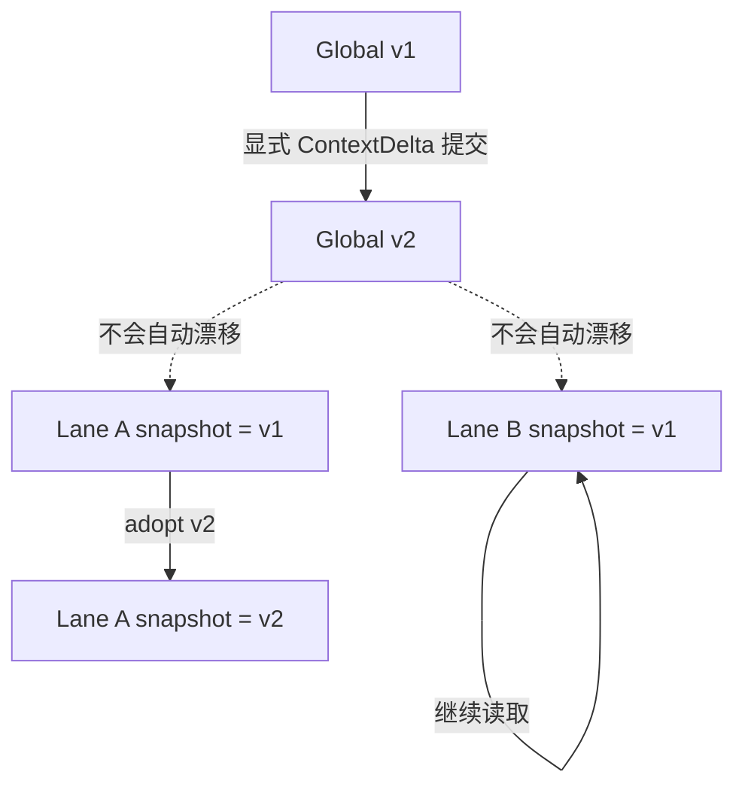
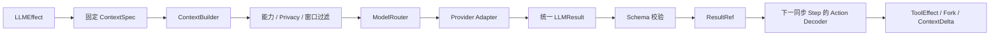

# Pulse Runtime

Pulse 是一个面向多步骤 Agent 应用的可恢复运行时。它把 Agent 的执行拆成多个独立的 Lane，每条 Lane 由同步、纯函数 Step 推进；模型调用、工具调用、人工输入和子 Agent 都作为受 Runtime 管理的 Effect 执行。

Pulse 关注的是执行语义：状态如何提交、并发如何调度、结果如何传递、取消和重试是否安全，以及模型换 Provider 后上下文是否仍然可重建。模型 Provider、工具和宿主 UI 都是可替换的适配层。

> 当前仓库包含架构规范、应用 DSL 规范和 M0/M1 实施计划；M0/M1 主链及部分 M1.5/M2 本地扩展已经实现并由确定性测试覆盖。真实 Provider、远程副作用和生产运维仍需独立环境验收。

## 为什么需要 Pulse

传统 Agent Loop 往往把这些事情混在一个异步函数里：调用模型、执行工具、写上下文、启动并行任务、等待结果和处理取消。这样很难保证进程重启、网络断开、模型切换或多个 Lane 并发时仍然保持一致。

Pulse 将它们拆成明确的状态转换：

```text
Agent
  └── Lane
        └── synchronous Step
              ├── ContextDelta       认知状态更新
              ├── RuntimeAction[]    控制意图
              └── EffectSubmission[] 外部执行意图
```

Step 不直接执行 I/O，也不直接修改 Runtime。它只返回候选输出，Runtime 统一校验并提交。

## 总体架构



运行时内核不依赖某个模型供应商。Provider Adapter 只负责把供应商响应归一化成统一的 `LLMResult`；它不会生成 RuntimeAction，也不会直接执行工具。

## 核心执行模型

### Lane、Step、Action 和 Effect



- **Agent** 拥有目标、策略、Limits 和根 Lane。
- **Lane** 是长期存在的可恢复执行线，不区分同步 Lane 和异步 Lane。
- **Step** 是同步执行切片，只能读取 Runtime 注入的固定输入并返回 `LaneStepOutput`。
- **Action** 表示取消、Fork、Wait、Adopt、完成或失败等控制意图。
- **Effect** 表示需要调度器和外部执行器完成的工作。
- **ResultRef** 指向不可变结果；Lane 通过引用消费结果，而不是把大输出复制进上下文。

### 原子 Step Commit

一次 Step 的认知更新、控制动作和下一执行位置必须一起提交。外部 Effect 只有在提交成功后才会派发。



`ContextDelta` 只携带认知状态变化，不能隐含 `cancel_lane` 或工具调用。任意一项校验失败，整个 `StepTransaction` 都不提交。

## Context 与 Snapshot

Pulse 使用三层 Context：Global Context、Lane Context 和单次 LLM Request Context。



- Global Context 按版本保存。
- Lane 的 Snapshot 固定在某个 Global 版本。
- Global 发布新版本不会偷偷改变其他 Lane。
- 只有显式 `adopt_context(v2 | 'latest')` 才会切换 Lane 的后续读取版本。
- 当前 Lane 自己提交 Global `ContextDelta` 时，可以使用 `adoptCommittedContext` 在同一事务内切换到新版本。
- LLM Request 使用固定的 `LLMContextSpec`，排队或重试期间不会被后来结果隐式改写。

## LLM 与 ModelRouter



统一结果形状为：

```ts
interface LLMResult {
  text?: string
  toolCalls?: {
    id: string       // Pulse 生成的 toolCallId
    name: string
    arguments: JsonValue
  }[]
  structured?: JsonValue
  finishReason: 'stop' | 'tool_call' | 'length' | 'refusal' | 'error'
  refusal?: { reason?: string; message?: string }
  usage?: ModelUsage
}
```

工具调用的关联由 Pulse 自己维护：

```text
Pulse toolCallId
  ↓
ToolEffect
  ↓
ResultRef
  ↓
下一轮模型或 Lane Step
```

它不依赖 Provider Thread，因此可以在下一轮切换模型，也可以从 Pulse 自己保存的 Context 和 ResultStore 重建请求。

## 隐私、取消与重试

### Privacy Label

隐私标签属于数据记录，而不是某次 LLM 请求的临时开关。M1 先执行请求级 `local_only` 云端阻断，M1.5 完成记录级标签传播。记录级标签为：

```text
public < cloud_allowed < local_only
```

派生、摘要、合并或拼接结果时，Runtime 取所有来源中最严格的标签，并保留 `derivedFrom`。包含 `local_only` 数据的请求不能发送到云端模型；降级只能通过可审计的人为批准或可信脱敏器产生新的派生对象。

### 远端未知状态

执行状态和业务副作用状态分开记录：

```text
纯 LLM：remote_unknown + sideEffectState=none
  → 可释放本地模型槽
  → 按 duplicateExecutionPolicy 有界重试或 fallback

写入型 Tool：remote_unknown + sideEffectState=unknown
  → reconcile_required / in_doubt
  → 不直接重复执行
```

### 取消与 Quarantine

取消是结构化状态转换。Owner 可以剪枝自有后代；非 Owner 只能提交 `propose_cancel`。如果外部系统无法确认停止，Effect 会进入 QuarantineScope，业务 Agent 可以带着 `unresolvedEffectIds` 返回，而不会被永久挂起。

## 进展监测

Progress Watchdog 不只统计 Event 数量，而是比较稳定的认知和执行指纹：

```text
goalStateHash
contextVersion
actionSignature
resultSignature
resumeStep
localsHash
```

重复 Action、Context/Finding 没有变化、Goal 没有推进时，Runtime 分级处理：注入 `control_error`、要求 Program replan、最后失败 Lane。被拒绝的 StepTransaction 不进入 Watchdog 窗口。

## DSL 示例

下面是应用层 DSL 的可运行用法。它编译成纯函数 Step 和可序列化 ResumePoint；Provider、ToolSet 和宿主凭证仍由应用侧注册与配置。

```ts
const program = defineLaneProgram({
  id: 'coding.main',
  version: '1',
  system: '你是资深排障工程师。按证据行动，不臆测。',
  toolSet: 'coding.default',
  state: MainState,
}, (builder) => {
  builder.addStructuredLLMStep('plan', {
    task: 'plan',
    instruction: (view) => `目标：${view.goal}。制定排查计划。`,
    schema: PlanSchema,
    onSuccess: (plan, ctx) => {
      ctx.mutateLane((draft) => { draft.plan = plan })
      return { step: 'dispatch' }
    },
  })

  builder.addParallelStep('dispatch', {
    lanes: {
      analyze: { goal: '分析根因', program: analyzeProgramRef },
      tests: { goal: '准备复现测试', program: testsProgramRef },
    },
    join: { condition: 'settled' },
    onJoin: (outcomes, ctx) => ({ step: 'verify' }),
  })
})
```

宿主有两种运行方式：

```ts
const outcome = await runtime.run(agent.id)

const session = runtime.start(agent.id)
for await (const event of session.stream()) {
  // 观测事件和事实事件镜像
}
const finalOutcome = await session.outcome()
```

`runtime.run()` 等待 Agent 收尾并返回 `Outcome`；`runtime.start()` 是 DSL 提供的交互式 Session Facade。流消费不会反向阻塞 Scheduler，事实事件丢失时通过 `gap + snapshot()` 重同步。

## MVP 路线

| 阶段 | 交付内容 |
| --- | --- |
| M0 | Lane 状态机、StepTransaction、依赖图、Scheduler、TimerWheel、取消、Quarantine、虚拟/真实单调时钟验收 |
| M1 | 三层 Context、稳定前缀、Provider Adapter、MockAdapter、Tool SDK、LLMResult、ModelRouter、DSL、确定性 E2E |
| M1.5 | record/leaf 级 Privacy/`derivedFrom`、Progress Watchdog、Storage pin/compact、Fork Affinity、warm start、动态 ToolSet、Host 工具 allow/deny |
| M2 | 持久化事务/outbox、崩溃恢复、RecoverableTool 对账、HTTP/HTTPS 与 SQLite Worker 协调、自适应路由、观察导出 |

M1 的真实 Provider 和网络任务通过独立 Live Smoke 验证；确定性 Gate 使用 Mock Executor、Virtual Clock 和离线 Fixtures。

## 仓库文档

- [Runtime 架构设计](./pulse-runtime-architecture.md)：核心状态模型、调度、Effect、Context、隐私和验收契约。
- [Application DSL 规范](./pulse-application-dsl-spec.md)：StepBuilder、模板、Session API 和应用层约束。
- [MVP 开发计划](./pulse-mvp-development-plan.md)：M0/M1 里程碑、任务拆解、门禁和测试策略。

## 当前验证边界

确定性实现和本地故障恢复已经由仓库测试覆盖，但这不等于所有生产环境都已验收。当前仍需要独立环境证明的项目包括：真实 Provider 凭证下的 Live Smoke、真实远程写系统的副作用对账、生产级持久化事务与多主机 Worker 故障注入、跨进程 Detached Agent scope 迁移、细粒度宿主权限/隐私策略，以及外部指标系统接入。

Provider Thread 仍不是状态源；自动 Fork 合并、动态工具检索和自适应路由已有确定性实现，但生产样本校准与外部服务兼容性仍需单独验证。所有能力继续遵守 Lane、Step、Action、Effect 和 StepTransaction 的核心语义。
